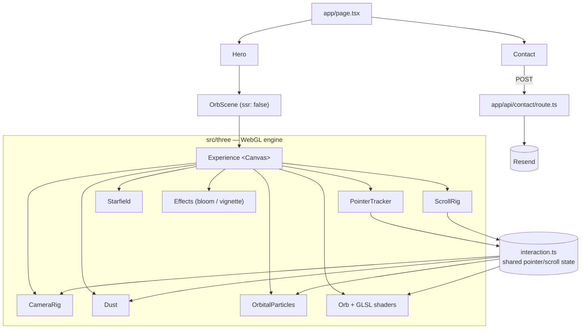

<div align="center">

# Armaan Punia — Portfolio

An immersive, dark-first single-page portfolio: a GPU-driven liquid-glass orb,
a living particle atmosphere, magnetic glass UI, and a real server-backed
contact form.

[](https://github.com/Armaan-94/portfolio/actions/workflows/ci.yml)
[](https://github.com/Armaan-94/portfolio/actions/workflows/codeql.yml)
[](LICENSE)
[](https://nextjs.org)
[](https://www.typescriptlang.org)

</div>

> [!NOTE]
> **Screenshots & demo** — replace these placeholders with real captures:
> `docs/media/hero.png`, `docs/media/demo.gif`. (Add the files and update the paths below.)
>
> <!--  -->
> <!--  -->

---

## Overview

A production single-page portfolio built with the Next.js App Router. The hero
is a real-time WebGL scene (React Three Fiber) centred on a custom-shader
"liquid glass" orb that reacts to the cursor and scroll; the rest of the page is
fast, accessible, server-rendered content driven from a single content file.

- **Live:** _add your Vercel URL here_
- **Contact:** the form sends real email through a serverless route (Resend).

## Features

- **Liquid-glass orb** — custom GLSL: domain-warped displacement, procedural
  studio-HDRI refraction/reflection with chromatic dispersion, flowing internal
  energy veins, thin-film iridescence, and subsurface glow.
- **Cursor + scroll reactive** — velocity-aware pointer, heavily-damped camera
  parallax with an idle dolly-breath, and a cinematic scroll that dollies the
  camera, sinks the orb, and parallaxes the atmosphere.
- **Living atmosphere** — three GPU particle layers (distant starfield, drifting
  cursor-repelling dust, orb-bound orbital swarm), all additive and depth-faded.
- **Premium UI** — `.glass-premium` surfaces, magnetic buttons that lean toward
  the cursor, and cursor-tracked spotlight cards.
- **Real contact form** — `POST /api/contact` validates server-side and sends
  via Resend, with a honeypot and graceful fallback when unconfigured.
- **Accessible & fast** — full `prefers-reduced-motion` support, device-tier
  quality scaling, self-hosted fonts, and generated (not remote) OG/favicon.

## Tech stack

| Area | Choice |
|---|---|
| Framework | **Next.js 16** (App Router) + **React 19** |
| Language | **TypeScript** (strict) |
| Styling | **Tailwind CSS v4** (CSS-based theme tokens) |
| 3D / WebGL | **three.js** + **@react-three/fiber** + **drei** + **postprocessing** |
| Motion | **motion** (Framer Motion) |
| Email | **Resend** (via a Next.js Route Handler) |
| Fonts / assets | **next/font** (Sora + JetBrains Mono), **next/og** |
| Hosting | **Vercel** |

## Architecture



Deeper engine notes (phases, shader design, performance rules) live in
[`src/three/README.md`](src/three/README.md).

## Getting started

**Prerequisites:** Node `>=20` (see [`.nvmrc`](.nvmrc)) and npm.

```bash
npm install
npm run dev        # http://localhost:3000
```

### Scripts

| Script | Does |
|---|---|
| `npm run dev` | Start the dev server (Turbopack) |
| `npm run build` | Production build |
| `npm run start` | Serve the production build |
| `npm run lint` | ESLint |
| `npm run typecheck` | `tsc --noEmit` |
| `npm run format` | Prettier write (requires `npm i -D prettier`) |
| `npm run format:check` | Prettier check (requires `npm i -D prettier`) |

> Prettier config ships in the repo (`.prettierrc.json`), but Prettier isn't a
> dependency yet — install it with `npm i -D prettier` if you want to adopt
> auto-formatting. ESLint is the enforced gate today.

## Environment variables

The contact form needs these to actually send. Locally they live in
`.env.local` (git-ignored); in production add them in your host's dashboard.

| Variable | Required | Purpose |
|---|---|---|
| `RESEND_API_KEY` | Yes (to send) | Resend API key. Without it, the form returns a friendly "email me directly" message. |
| `CONTACT_TO_EMAIL` | No | Destination inbox. Defaults to the address in `src/content.ts`. |

```bash
# .env.local
RESEND_API_KEY=re_xxxxxxxxxxxxxxxxxxxx
CONTACT_TO_EMAIL=you@example.com
```

## Project structure

```
src/
  app/
    layout.tsx              # fonts, metadata, OG/SEO, viewport
    page.tsx                # section assembly
    globals.css             # brand tokens, glass utilities, base styles
    icon.tsx                # generated "AP" favicon
    opengraph-image.tsx     # generated 1200x630 social image
    api/contact/route.ts    # server-side contact form (Resend)
  components/                # Nav, Hero, About, Projects, Contact, …
                             # MagneticButton, SpotlightCard, primitives
  content.ts                # ALL editable content (single source of truth)
  three/                    # the WebGL engine (see its own README)
    Experience.tsx          # the <Canvas>
    scene/                  # Orb, camera, particles, rigs
    shaders/                # GLSL (orb + particles)
    materials/ util/        # material factory, quality tiers, RNG
public/                      # resume PDF, portrait, static assets
```

## Editing content

All copy — profile text, experience, projects, skills, links — lives in one
file: **`src/content.ts`**. Nothing is hard-coded in components.

## Deployment (Vercel)

1. Import the repo at [vercel.com/new](https://vercel.com/new) — Next.js is
   auto-detected.
2. Add the environment variables above (Settings → Environment Variables).
3. Deploy. Every push to `main` then auto-deploys.

CLI alternative: `npm i -g vercel && vercel --prod`.

## Accessibility & performance

- Semantic landmarks, ordered headings, labelled controls, visible focus rings.
- `prefers-reduced-motion` freezes the scene, camera, particles, and UI motion.
- Device-tier quality scaling (orb detail, particle counts, pixel-ratio cap) and
  a render-loop pause when the hero is off-screen or the tab is hidden.
- Self-hosted fonts, generated images, minimal client JS.

## Contributing

See [CONTRIBUTING.md](CONTRIBUTING.md). In short: `npm run lint && npm run
typecheck && npm run build` must pass; content goes in `src/content.ts`;
Conventional Commits.

## Roadmap

- [ ] Add real screenshots + a demo GIF (`docs/media/`).
- [ ] Wire live LeetCode/GitHub stats into the activity section.
- [ ] Optional: custom Resend domain for a branded sender address.
- [ ] Playwright smoke test + Lighthouse CI budget in the pipeline.

## License

[MIT](LICENSE) © 2026 Armaan Punia.

## Acknowledgements

Built with [Next.js](https://nextjs.org), [React Three Fiber](https://r3f.docs.pmnd.rs/),
[drei](https://github.com/pmndrs/drei), [motion](https://motion.dev),
[Tailwind CSS](https://tailwindcss.com), and [Resend](https://resend.com).
Simplex noise by Ashima Arts.
